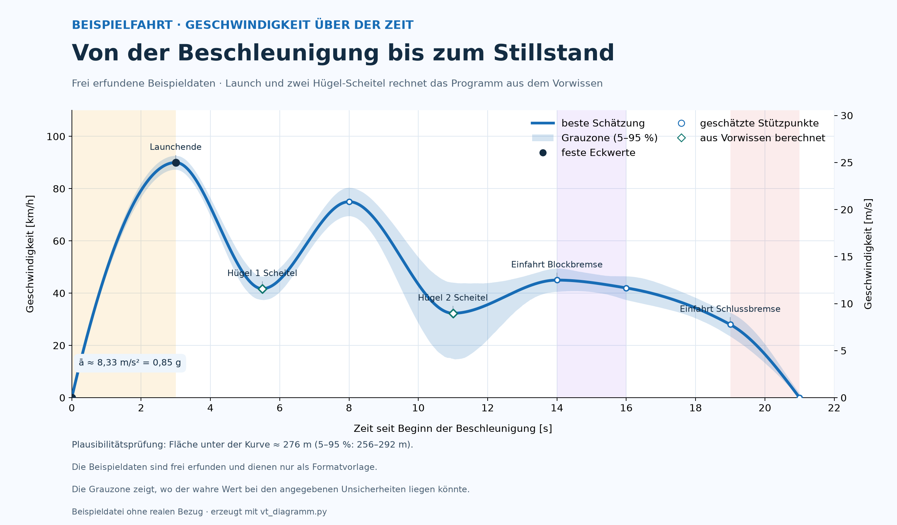

# vt-diagramm

Erzeugt aus **manuell eingegebenen Daten** ein Geschwindigkeit-Zeit-Diagramm
mit **Grauzone**. Gedacht für Auswertungen, bei denen Zeitmarken aus einem
Video stammen und einzelne Werte bereits bekannt sind – zum Beispiel die
Beschleunigung am Anfang oder die Höhe einer Kurve. Es findet **keine
automatische Videoanalyse** statt; alle Werte werden in eine CSV- und eine
TOML-Datei eingetragen.

Die Grauzone zeigt, wo der tatsächliche Wert liegen könnte: entweder als
5-%-bis-95-%-Band aus einer Monte-Carlo-Simulation oder als Hülle aus den
angegebenen Unsicherheiten.



## Inhalt

- [Installation](#installation)
- [Schnellstart](#schnellstart)
- [Eingabedateien](#eingabedateien)
  - [Stützpunkte (CSV)](#stützpunkte-csv)
  - [Konfiguration (TOML)](#konfiguration-toml)
  - [Vorwissen: Beschleunigung und Höhen](#vorwissen-beschleunigung-und-höhen)
  - [Beschriftungen, Notizen, Farben](#beschriftungen-notizen-farben)
- [Die Grauzone](#die-grauzone)
- [Kommandozeile](#kommandozeile)
- [Physik und Grenzen](#physik-und-grenzen)
- [Dateien im Repository](#dateien-im-repository)

## Installation

Voraussetzung: Python 3.11 oder neuer (wegen `tomllib`).

```bash
python3 -m venv .venv
.venv/bin/python -m pip install -r requirements.txt
```

## Schnellstart

```bash
.venv/bin/python vt_diagramm.py beispiel.toml
```

Erzeugt `beispiel.png`, `beispiel.svg` und `beispiel.pdf`, gibt eine
Werteübersicht auf der Konsole aus und schreibt den Weg (Fläche unter der
Kurve) als Plausibilitätsprüfung in die Fußzeile.

Nur prüfen, ohne Monte-Carlo und ohne Dateien:

```bash
.venv/bin/python vt_diagramm.py beispiel.toml --pruefen
```

## Eingabedateien

Eine Konfiguration besteht aus zwei Teilen:

| Datei | Inhalt |
| --- | --- |
| `beispiel.toml` | Titel, Achsen, Farben, Phasen, Vorwissen und Verweis auf die CSV |
| `beispiel_stuetzpunkte.csv` | Zeitmarken mit geschätzter Geschwindigkeit und Unsicherheit |

### Stützpunkte (CSV)

Eine Zeile pro Stützpunkt. Spaltennamen werden über mehrere Schreibweisen
erkannt, zusätzliche Spalten (z. B. `grundlage`) werden ignoriert.

| Bedeutung | Erkannte Spaltennamen | Pflicht |
| --- | --- | --- |
| Zeit seit Start [s] | `t_s`, `zeit_s`, `zeit_seit_launch_s` | ja |
| Name des Punkts | `name`, `element`, `bezeichnung` | ja |
| Geschwindigkeit [km/h] | `v_kmh`, `geschwindigkeit_kmh` | ja |
| Unsicherheit [km/h] | `u_kmh`, `unsicherheit_kmh`, `unsicherheit` | nein (Standard 0) |
| Unsicherheit der Zeit [s] | `u_s`, `unsicherheit_s` | nein (Standard 0) |

```csv
t_s,name,v_kmh,u_kmh,grundlage
8.0,Tal,75,6,Videozeit plus Energieabschaetzung
14.0,Einfahrt Blockbremse,45,5,Videozeit plus Energieabschaetzung
```

Regeln: Namen müssen eindeutig sein, Zeiten streng aufsteigend, keine
negativen Werte. Einheiten: km/h für Geschwindigkeiten, Sekunden für Zeiten,
Meter für Höhen.

### Konfiguration (TOML)

#### `[diagramm]` – Titel und Ausgabe

| Schlüssel | Bedeutung | Standard |
| --- | --- | --- |
| `titel` | kleine Zeile oben | „GESCHWINDIGKEIT–ZEIT-DIAGRAMM“ |
| `untertitel` | große Überschrift | – |
| `beschreibung` | Zeile unter der Überschrift | – |
| `video_start` | Startzeit im Video, z. B. `"0:42,5"`; blendet eine zweite Zeitachse oben ein | – |
| `band_modus` | `"monte-carlo"` oder `"huelle"` | `"monte-carlo"` |
| `band_max` | obere Kappung der Grauzone in km/h | – |
| `weg_anzeigen` | Weg-Prüfung in der Fußzeile | `true` |
| `ziehungen` | Anzahl Monte-Carlo-Ziehungen | `2000` |
| `seed` | Startwert für reproduzierbare Bänder | zufällig |
| `verteilung` | `"uniform"` (Wert liegt irgendwo in ±u) oder `"normal"` (u = 1σ) | `"uniform"` |
| `ausgabe` | Basisname der Dateien ohne Endung | Name der TOML-Datei |
| `formate` | z. B. `"png,svg,pdf"` | `"png,svg,pdf"` |
| `sichere_punkte` | Namen, die als feste Eckwerte (dunkle Punkte) markiert werden | – |
| `beschriften` | Liste von Namen oder Tabellen (siehe unten) | keine |
| `fusszeilen` | Liste von Textblöcken; `{weg}`, `{weg_unten}`, `{weg_oben}` werden ersetzt | – |
| `quellen` | Quellenzeile ganz unten | – |
| `fuss_y` | feste y-Positionen der Textblöcke (z. B. `[0.105, 0.062, 0.028]`) | automatisch |
| `fuss_zeilenabstand` | Zeilenabstand mehrzeiliger Textblöcke | `1.2` |

#### `[achsen]` – Achsen und Layout

| Schlüssel | Bedeutung | Standard |
| --- | --- | --- |
| `x_max`, `y_max` | Achsenenden | aus den Daten |
| `x_tick`, `y_tick` | Abstand der Hilfslinien | `5`, `20` |
| `rand_rechts` | rechter Rand im Bild (0–1) | `0.93` |
| `y2_achse` | zweite y-Achse in m/s anzeigen | `true` |
| `x_label`, `y_label`, `y2_label` | Achsenbeschriftungen | deutsch, passend |

#### `[stuetzen]` – Verweis auf die CSV

```toml
[stuetzen]
datei = "beispiel_stuetzpunkte.csv"   # relativ zur TOML-Datei
```

#### `[[phase]]` – farbige Zeitabschnitte

```toml
[[phase]]
von_s = 0.0
bis_s = 3.0
farbe = "#f59e0b"
alpha = 0.12
```

### Vorwissen: Beschleunigung und Höhen

Bekannte Werte werden nicht als km/h-Zeile eingetragen, sondern als Faktum.
Das Programm rechnet daraus Stützpunkte samt Unsicherheit und markiert sie
als Rauten („aus Vorwissen berechnet“). Punkte, die so entstehen, dürfen
nicht zusätzlich in der CSV stehen.

#### `art = "beschleunigung"`

Aus Start- und Endgeschwindigkeit, Dauer und deren Unsicherheiten entstehen
zwei Stützpunkte; zusätzlich wird die mittlere Beschleunigung
`ā = Δv/Δt` mit 5-%-bis-95-%-Bereich berechnet und in die Konsole
geschrieben.

```toml
[[bekannt]]
name = "Launchende"          # Name des Endpunkts
name_start = "Start"         # Name des Startpunkts (optional)
art = "beschleunigung"
t_s = 0.0                    # Zeit des Starts
dauer_s = 3.0
von_kmh = 0.0
nach_kmh = 90.0
u_von_kmh = 0.0
u_nach_kmh = 3.0
u_dauer_s = 0.1
u_t_s = 0.0                  # Unsicherheit der Startzeit
```

#### `art = "hoehe"`

Die Geschwindigkeit am Scheitel folgt aus Energieerhaltung:

```
v² = v_referenz² − 2·g·Δh − v_verlust²        (alle Werte in m/s)
```

`verlust_kmh` fasst Reibung und Rollwiderstand als geschwindigkeitsäquivalenten
Verlust zusammen. `referenz` ist der Name eines bereits definierten Punkts
(z. B. das Tal vor der Steigung), `t_s` die Zeit am Scheitel.

```toml
[[bekannt]]
name = "Hügel 2 Scheitel"
art = "hoehe"
t_s = 11.0
referenz = "Tal"
hoehe_m = 18.0
u_hoehe_m = 1.0
verlust_kmh = 2.0
u_verlust_kmh = 1.0
unsicherheit_modus = "fortpflanzung"
u_t_s = 0.2
```

| Schlüssel | Bedeutung | Standard |
| --- | --- | --- |
| `unsicherheit_modus` | `"fortpflanzung"`: Unsicherheiten von Referenz, Höhe und Verlust werden per Monte Carlo durchgereicht (physikalisch ehrlich, an Scheiteln oft breit) – `"fest"`: Wert wird aus den Nennwerten berechnet, Unsicherheit gibt `u_v_kmh` vor | `"fortpflanzung"` |
| `u_v_kmh` | Unsicherheit bei `"fest"` | – |
| `referenz_unsicherheit_kmh` | überschreibt die Unsicherheit der Referenz nur für dieses Faktum | Unsicherheit des Referenzpunkts |

Hinweis: Nahe einem Scheitel ist `v` sehr empfindlich gegenüber der
Referenzgeschwindigkeit – kleine Unsicherheiten ergeben dort eine breite
Grauzone. Das Programm meldet, wenn Ziehungen den Scheitel rechnerisch nicht
erreichen (dann wird 0 km/h angenommen).

### Beschriftungen, Notizen, Farben

`beschriften` enthält Namen aus der CSV oder Tabellen mit vollem Zugriff:

```toml
beschriften = [
    "Launchende",                                            # Text = Name
    { name = "Hügel 2 Scheitel", versatz = [0, 20] },        # Offset in Punkten
    { punkt = [24.5, 51], text = "Blockbremse\nca. 20 m hoch",
      versatz = [0, 13], ausrichtung = "mitte", vertikal = "unten" },
]
```

| Schlüssel | Bedeutung |
| --- | --- |
| `name` | Stützpunkt, an dem die Beschriftung hängt |
| `text` | Text (mehrzeilig mit `\n`), Standard ist der Name |
| `punkt` | Anker `[t, v]` in Datenkoordinaten statt eines Stützpunkts |
| `versatz` | Verschiebung `[dx, dy]` in Punkten |
| `ausrichtung` | `"links"`, `"mitte"`, `"rechts"` (horizontal) |
| `vertikal` | `"oben"`, `"mitte"`, `"unten"` (vertikal) |
| `seite` | Kurzform: `"oben"`, `"unten"`, `"links"`, `"rechts"` |

Alternativ können Texte/Offsets zentral in `[diagramm.beschriftungen]`
hinterlegt werden (Schlüssel ist der Punktname).

`[[notiz]]` setzt eine Textbox in Datenkoordinaten, z. B. für eine
Rechennotiz:

```toml
[[notiz]]
x = 1.05
y = 16
text = "ā ≈ 11,1 m/s² ≈ 1,13 g"
groesse = 11
```

Unter `[diagramm.legende]` lassen sich die Legendentexte ersetzen
(`linie`, `band`, `feste`, `geschaetzt`, `vorwissen`), unter
`[diagramm.farben]` z. B. `band_alpha`.

## Die Grauzone

| Modus | Vorgehen | Eigenschaften |
| --- | --- | --- |
| `monte-carlo` (Standard) | Jede Ziehung würfelt alle Stützpunkte innerhalb ihrer Unsicherheit neu aus, abgeleitete Höhen-/Beschleunigungspunkte werden daraus berechnet (Korrelationen bleiben erhalten), dann wird interpoliert. Anschließend Perzentile über alle Verläufe. | Zeigt, wo die Kurve bei den angegebenen Unsicherheiten plausibel liegt; das Band ist zwischen Stützpunkten schmaler, an den Punkten selbst am breitesten. |
| `huelle` | Pro Stützpunkt werden 5-%- und 95-%-Werte bestimmt und als obere/untere Hülle interpoliert (bei einfachen Punkten entspricht das `v ± u`). | Schnell und breit; entspricht dem klassischen Fehlerbalken-Band. |

In beiden Modi wird die Grauzone bei 0 km/h abgeschnitten; `band_max` kappt
zusätzlich nach oben. Der Modus lässt sich in der TOML oder per
`--band huelle|monte-carlo` wählen.

Die Fläche unter der Kurve wird als Weg in Metern ausgegeben (Median und
5-%-bis-95-%-Bereich). Das ist eine Plausibilitätsprüfung, keine Messung:
Der Wert muss zur tatsächlichen Streckenlänge des dargestellten Abschnitts
passen.

## Kommandozeile

```
vt_diagramm.py KONFIG [--n N] [--seed S] [--verteilung uniform|normal]
              [--band monte-carlo|huelle] [--ausgabe NAME]
              [--formate png,svg,pdf] [--kein-band] [--pruefen]
```

| Option | Wirkung |
| --- | --- |
| `--n` | Anzahl der Monte-Carlo-Ziehungen (mindestens 10) |
| `--seed` | Zufallsstartwert für genau reproduzierbare Bänder |
| `--verteilung` | `uniform` (Standard) oder `normal` |
| `--band` | `monte-carlo` oder `huelle` |
| `--ausgabe` | Basisname der Ausgabedateien (auch absolute Pfade möglich) |
| `--formate` | Kommagetrennte Dateiformate |
| `--kein-band` | Grauzone nicht zeichnen |
| `--pruefen` | nur Konfiguration und Werte prüfen, keine Dateien |

Fehler (fehlende Spalten, unbekannte Referenzen, doppelte Zeiten …) werden
mit klarer Meldung und Rückgabewert 1 abgebrochen.

## Physik und Grenzen

- Die Beschleunigungsangabe aus `art = "beschleunigung"` ist eine mittlere
  Längsbeschleunigung. Beworbene Maximalwerte (z. B. durch Kurven) sind
  etwas anderes und dürfen nicht als konstante Beschleunigung eingetragen
  werden.
- `art = "hoehe"` nutzt ein Punktmassenmodell ohne Rollreibung; Verluste
  werden über `verlust_kmh` erfasst. Für lange Züge ist das eine
  Vereinfachung.
- Die Unsicherheiten sind **Nutzerangaben**, keine Statistik. Die Grauzone
  ist nur so belastbar wie die eingetragenen Zahlen.
- Das Programm liest keine Videos aus. Es gibt keine Messkurve; Kurve und
  Band entstehen allein aus den eingetragenen Werten und Modellannahmen.
- Ausgaben mit `--pruefen` und die Konsolenübersicht machen jede Annahme
  nachvollziehbar: Nennwerte, Herkunft (CSV oder Vorwissen) und der
  berechnete Weg.

## Dateien im Repository

| Datei | Zweck |
| --- | --- |
| `vt_diagramm.py` | das Programm |
| `beispiel.toml` | Beispielkonfiguration (Vorwissen + Monte-Carlo-Band) |
| `beispiel_stuetzpunkte.csv` | Beispieldaten (frei erfunden) |
| `beispiel.png`, `beispiel.svg`, `beispiel.pdf` | Beispielausgaben |
| `requirements.txt` | benötigte Pakete |
| `README.md` | diese Anleitung |
| `.gitignore` | ignoriert `.venv/` und `__pycache__/` |